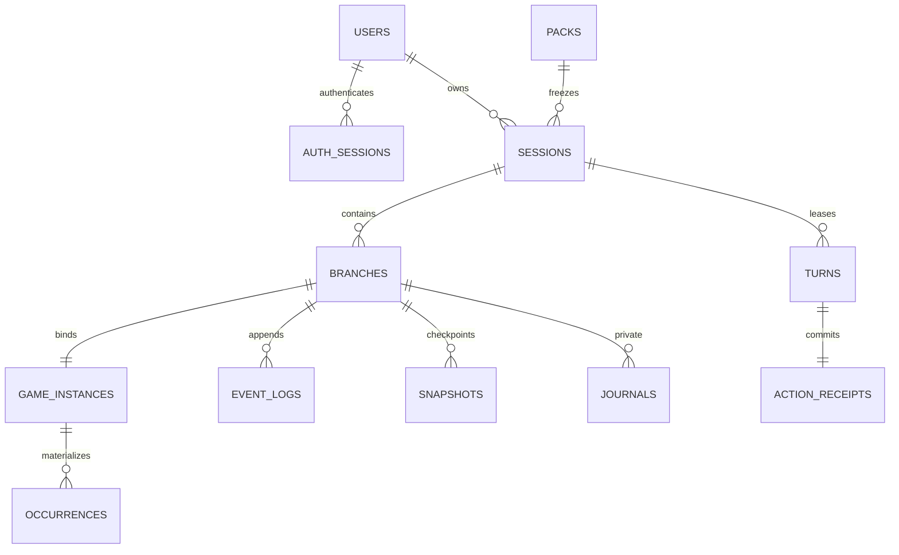

# 数据、AI 与运行手册

## 已实现边界

首发方案是单个 Node/Nitro 写服务 + 本地持久卷 SQLite/WAL + better-sqlite3 + Drizzle。数据库路径通过 DATABASE_PATH 指向持久目录；默认仓库 `.data/careerscape.sqlite`，独立输出部署则默认当前工作目录的 `.data`。容器临时文件系统、多个独立写节点与网络盘共享 SQLite 不在本方案范围。

SQL 是带参数的固定语句；不把用户或模型字符串当 SQL。Drizzle schema 提供核心表映射，账户创建使用 Drizzle，事件提交使用同一底层连接的短 immediate 事务以明确写锁。DDL 权威文本为 `packages/database/migrations/0001_initial.sql` 与新增 `0002_galgame.sql`，等价 `migration.ts` 内嵌供 Nitro bundler 使用，避免部署后丢失迁移文件。schema_migrations 记录版本，启动仅顺序执行尚未应用的迁移。0002为既有packs/sessions增加默认story模式，保存职业实例、每日额度和真实模型调用元数据；故障、回执、配额和归档细节见[AI职业故事说明](galgame.md)。

数据库包含账号/服务端身份/恢复码/限流/删除指纹、职业Profile/来源/事实/模板/批任务/审核/发布/审计、玩家局/分支/实例/事件/快照/动作回执/生成租约/事件实例、手账/反馈和模型用量元数据。`owner_id` 外键级联覆盖私密数据；仅脱敏删除记录可保留。



当前每个已提交事件都保存快照，偏向易验证的 P0。分支共享前缀通过 parent_branch_id/fork_event_seq 引用，后续文本不重新生成；快照和事件存同一事务。每个实例保存演员/项目/事件池/seed/算法/所有内容版本；同 seed 只保证规则抽样一致，不假装重现在线模型。

## 可复现命令

```sh
pnpm db:migrate
pnpm db:seed
pnpm exec tsx scripts/db.ts bootstrap-admin 已注册用户名
pnpm db:backup
pnpm exec tsx scripts/db.ts restore-verify .data/backups/某次备份.sqlite .data/恢复验证.sqlite
pnpm exec vitest run tests/backend.test.ts
```

seed 是公开原创合成 fixture，未读取真实个人资料。美术不齐时 seed 创建 approved 内容且目录显示 preparing；`db:seed` 在完整资源就绪后可幂等地推进合成演示初版发布。它不会覆盖编辑草稿或已发布版本。bootstrap-admin 仅给已注册账号授予内容角色，不含默认密码、后门账户或 HTTP 免登录入口。正式部署必须把该命令限定在服务器管理员会话。

备份采用 SQLite online backup API；生成后运行 integrity_check、foreign_key_check 并保存 SHA-256 和关键表行数清单。恢复命令只写一个不存在的新文件，不覆盖在线数据库，复查 hash 和外键，读取当前数据库的 account_deletions 对恢复副本重放删除，然后验证。恢复测试只证明本地数据库恢复，没有模拟机房级灾备。

备份包含个人数据，必须放在访问受控、加密存储或加密卷中；代码没有内置云备份或存储加密。运营必须执行最多 30 天备份保留与删除指纹留存策略。恢复上线前需要保留最新删除指纹，运行恢复验证、撤销恢复出的设备 sessions，并在维护窗口切换 DATABASE_PATH。不得直接复制旧备份覆盖线上库使已删除账户复活。

## AI provider

默认 `AI_PROVIDER=mock`；回复明显标注【模拟对话】，用量为零，不发网络模型请求。Google 原生 provider 使用 `AI_PROVIDER=google`、`GOOGLE_GENERATIVE_AI_API_KEY`、`GOOGLE_MODEL`，可设置 `GOOGLE_BASE_URL`；OpenAI 兼容 provider 使用 `AI_PROVIDER=openai`、`OPENAI_API_KEY`、`OPENAI_MODEL` 和 `OPENAI_BASE_URL`。key 仅在服务端环境中，后台只展示 provider/model/prompt 版本名。

SDK7 的 `generateText`、`streamText`、`tool` 和 `stepCountIs` 已使用安装包类型编译。在线接口使用 generateText 完成候选后再事务提交；独立 streamRoleText 提供只读流式表达适配，P0玩家未启用未提交预览。白名单工具仅 readKnownFact，逐次核对角色可知事实 ID，无任意网络/文件/SQL能力、无业务副作用，最多两步及两次工具执行，24,000字符上下文上限，500 output tokens，25秒超时，SDK重试0。工具不负责推进剧情。

每次角色调用只提供自己的设定、已知事实及 sourceEventIds、实际收到的群聊/本人私聊、当前允许行动与玩家输入。旁白解释、手账、其他NPC私聊、其他分支和未来节点不进入上下文。角色工具只读；规则裁定才能更新状态。自由输入默认是对话，不把“帮我提交”误当成已执行。

真实模型失败返回安全错误，回合不提交；只有显式 mock 配置产生模拟回复。上游失败仍可能产生费用，不能当作真实无费用。Google 配置和真实验收步骤见 `galgame.md`：`pnpm ai:smoke` 验证旧剧情、工具与流式，`pnpm galgame:smoke` 验证三职业流程；两者使用隔离内存数据库。记录 provider/model/prompt/pack/事实ID/token/延迟/费用来源，不记录思维链或完整 prompt。

## 部署要求与后续路径

反代启用 HTTPS；设置准确 APP_ORIGIN，production Cookie 强制 Secure。唯一的本地生产预览例外是明确设置 `COOKIE_SECURE=false` 且请求 hostname 为 `localhost`、`127.0.0.1` 或 `::1`；其他 production hostname 忽略该降级开关，始终 Secure。开发 NODE_ENV 不强制 Secure。`/api/**` 禁共享缓存；JSONL 关闭代理缓冲，超时至少 60秒。反代 body 上限 512KB、连接/请求限流并按本站 origin 使用。API 另做 schema、长度、CSRF 和所有权校验。内容管理路径在生产网络层限制到受控 VPN/管理员网络；P1再接入MFA，不能把当前密码登录称为已实现MFA。

Nitro `.output` 可独立发布，但必须同时携带 `server/` 和完整 `public/`，不能只拷贝 server。在 `.output` 目录启动 `node server/index.mjs`，设置绝对 `DATABASE_PATH=/持久卷/careerscape.sqlite`，建议设置绝对 `ASSET_PUBLIC_DIR=/部署目录/public`。不设置时资源门禁按仓库 apps/web/public、当前 public、上级 public 顺序查找。资源优先按 `manifest-<assetManifestVersion>.json` 冻结清单验证，连同retina与mobile全部校验，v2必须有4个独立竖构图。嵌入的迁移与seed已被服务端bundle包含，不依赖部署时存在 TypeScript 源文件。空库初始化v2并保留v1历史版本；已有发布/回退入口不会被进程重启改回初版，新引入的v2在已有活动版本的库中保持approved，需要明确的后台发布。seed不覆盖已发布正文。

远程 libSQL/Turso 是有条件的备选：需先核验官方驱动事务、迁移、延迟、地区和备份行为，再实现同等 repository 并重跑并发/归属/恢复测试；当前没有仅换 URL 的等价承诺，也未部署远程库。多写扩容需要单独 ADR，不通过共享 SQLite 网络磁盘解决。

账号变更绑定、邮箱/手机号第二因子、组织/SSO、多管理员MFA等按 P1/P2 路线图执行。P0 无公共学生私密记录查询接口；后续临时支持访问必须另建授权、范围和审计。
