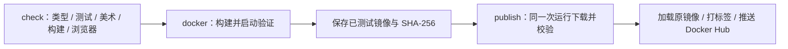

# CI/CD 与 Docker Hub 发布

工作流为 [`.github/workflows/ci.yml`](../.github/workflows/ci.yml)，在 Actions 中显示为 **CI and Docker**。目标镜像固定为 **`docker.io/yunyunjuan/careerscape`**；当前构建、验证和发布的平台为 **`linux/amd64`**，尚未提供 ARM64 多架构镜像。

开发与 PR 要求见[贡献指南](../CONTRIBUTING.md)，运行参数、SQLite 持久化和恢复见[部署说明](deployment.md)。本工作流发布容器镜像，不自动部署服务器或修改线上数据库。

## 三个顺序执行的 job

1. **check** 使用 Ubuntu、Node.js 24.16.0 和 pnpm 12.6.0。依次安装锁定依赖，运行 Nuxt 准备、Nuxt/根 TypeScript、lint、Vitest、v1/v2 美术核验、生产构建及 Chromium 浏览器流程。测试使用隔离 SQLite、合成内容和 mock，不需要真实模型凭据。
2. **docker** 依赖 check 成功，校验 Compose 配置，通过 Buildx 构建并加载 `careerscape:ci`，此时 `push:false`。随后运行 [`scripts/docker-smoke.mjs`](../scripts/docker-smoke.mjs)，再用 `docker save` 导出同一个已测试镜像，压缩并生成 SHA-256 文件。
3. **publish** 同时依赖 check 和 docker 成功，并检查下述仓库、触发范围与凭据。它只下载**同一次 Actions 运行**的镜像 artifact，校验 SHA-256，执行 `docker load`、`docker tag` 与 `docker push`；发布步骤没有重新构建镜像。

容器启动检查使用随机命名的独立数据卷、仅 loopback 暴露的端口、非 root 用户、只读根文件系统与 mock。它检查健康状态、首页、可玩内容、游客认领、实际提交和回执、手账、数据库与密码流程、固定美术清单及文件哈希、后台授权审计，并在重启与重建容器后确认数据仍可读取。测试最终清理自己的容器与数据卷，不使用生产存档。

先验证镜像再推送的原则可参阅 [Docker 官方 test-before-push 指南](https://docs.docker.com/build/ci/github-actions/test-before-push/)。本仓库使用单平台镜像 artifact 在 job 之间传递，发布的是先前加载并测试的镜像。

## 触发与发布条件

| 触发来源                   | 质量检查与镜像验证   | Docker Hub 发布                                                |
| -------------------------- | -------------------- | -------------------------------------------------------------- |
| Pull request               | 执行 check 和 docker | 整个 publish job 跳过，不登录、不读取发布凭据、不推镜像        |
| 普通分支 push              | 执行 check 和 docker | 仅原仓库实际默认分支允许发布；其他分支只验证                   |
| `v*` tag push              | 执行 check 和 docker | 原仓库通过验证且凭据齐全后发布对应标签                         |
| 手动运行，`publish` 未勾选 | 执行 check 和 docker | 跳过发布；布尔输入默认 `false`                                 |
| 手动运行，`publish` 已勾选 | 执行 check 和 docker | 原仓库还必须选择实际默认分支或 `refs/tags/v…`，其他 ref 不发布 |

发布 job 还要求 `github.repository == 'guoweiyi/CareerScape'`，fork 中的工作流不会向此固定镜像目标发布。默认分支通过 `github.event.repository.default_branch` 动态判断，没有写死 `main`。PR 使用 `pull_request`，不是 `pull_request_target`。

工作流的 GitHub token 权限为 `contents: read`，未申请仓库写入权限；Docker Hub 凭据只传给发布 job 的凭据检查和登录步骤。第三方 Actions 固定到完整提交 SHA。

2026-10-08 已核对并固定支持 Node 24 的 checkout 7.0.1、setup-node 7.1.0、pnpm/action-setup 6.1.0、upload-artifact 7.0.2 与 download-artifact 8.0.2。使用 GitHub 托管 Ubuntu runner；自托管 runner 至少需要 2.327.1。镜像 artifact 保持默认 ZIP 归档和解压语义，不设置 `archive:false`。兼容依据：[checkout](https://github.com/actions/checkout/tree/v7.0.1#whats-new)、[setup-node](https://github.com/actions/setup-node/tree/v7.1.0#whats-new-in-v7)、[pnpm v12 支持](https://github.com/pnpm/action-setup/releases/tag/v6.1.0)、[上传输入](https://github.com/actions/upload-artifact/blob/v7.0.2/action.yml)、[下载输入](https://github.com/actions/download-artifact/blob/v8.0.2/action.yml)。

分支 push 和 PR 如果只修改 `docs/**`、`README.md`、`CONTRIBUTING.md` 或 `.github/PULL_REQUEST_TEMPLATE.md`，整个工作流按 `paths-ignore` 跳过。手动运行不受该过滤影响；tag push 不按文件路径过滤。GitHub 的路径过滤语义见[官方工作流语法](https://docs.github.com/en/actions/reference/workflows-and-actions/workflow-syntax#onpushpull_requestpull_request_targetpathspaths-ignore)。

并发组为“工作流名称 + ref”。同一分支或 PR ref 的新运行会取消旧运行；tag ref 不启用自动取消。已经完成的推送不会因后续运行取消而回滚，排查时应看具体步骤与发布摘要。

## 配置凭据并首次发布

维护者在 Docker Hub 创建具有目标仓库推送权限的 access token，然后在 GitHub 仓库 **Settings → Secrets and variables → Actions** 添加两个 repository secrets：

| Secret               | 填写内容                                                                             |
| -------------------- | ------------------------------------------------------------------------------------ |
| `DOCKERHUB_USERNAME` | Docker Hub 登录账号，预期为 `yunyunjuan`，必须对 `yunyunjuan/careerscape` 有推送权限 |
| `DOCKERHUB_TOKEN`    | Docker Hub access token，不使用账号密码                                              |

Token 用于自动化身份认证，权限与撤销方式见 [Docker 官方 access tokens 文档](https://docs.docker.com/security/access-tokens/)。凭据由维护者自行填入 GitHub，无需发到聊天、PR 或仓库文件，也不会作为构建参数写入镜像。

配置后，在 **Actions → CI and Docker → Run workflow** 中选择仓库的**实际默认分支**，勾选 **publish** 后运行。工作流会重新完成 check 和 docker，再发布本次验证的镜像。只添加 Secrets 不会自动补跑先前的发布步骤；普通功能分支即使勾选 publish 也不会推送。

任一 Secret 缺失时，发布 job 写出 warning 和摘要，跳过下载、加载、登录和推送；此前成功构建的镜像 artifact 仍可下载。因此整次运行显示绿色，也可能是“验证成功、发布因缺凭据跳过”。如果凭据已填写但登录或推送失败，相应步骤失败，不会记为发布成功。

## 实际镜像标签

下表标签均位于 `docker.io/yunyunjuan/careerscape`：

| 来源                          | 发布的标签                                           |
| ----------------------------- | ---------------------------------------------------- |
| 每次允许发布的运行            | `sha-<完整提交 SHA>`，由 `type=sha,format=long` 生成 |
| 实际默认分支                  | 除 SHA 标签外，更新 `latest`                         |
| `v1.2.3` tag                  | SHA 标签、`v1.2.3` 和 SemVer 别名 `1.2.3`            |
| `v1.2.3-rc.1` tag             | SHA 标签、`v1.2.3-rc.1` 和 `1.2.3-rc.1`              |
| 其他匹配 `v*` 的非 SemVer tag | SHA 标签和对应 Git tag 的镜像标签；没有 SemVer 别名  |

当前触发条件允许 `v*`，并非只允许 `vX.Y.Z`。SemVer 规则只生成完整版本别名，不生成 major/minor 浮动标签。`latest` 自动生成被关闭，仅默认分支的显式规则开启；版本 tag 不更新 `latest`。不符合 Docker 标签字符要求的 Git tag 会按 metadata-action 规则规范化，标签行为见[官方 metadata-action 文档](https://github.com/docker/metadata-action#tags-input)。

SHA 标签关联源代码提交；精确识别已发布镜像时使用本次运行记录的 digest。各标签逐个推送，不是一次原子操作；中途失败时已有标签可能已推送，应以步骤日志与摘要核对结果。

## Artifact 与结果核验

工作流显式上传的两个 artifact 均配置保留 **7 天**：

- **browser-evidence**：测试结束时尝试上传 `test-results/`、`playwright-report/` 和 `docs/screenshots/`，包含浏览器失败证据及页面截图。
- **careerscape-image**：仅在镜像构建和启动检查成功后上传，包含 `careerscape-image.tar.gz` 与 `careerscape-image.sha256`。它是本次已测试镜像，缺少 Docker Hub Secrets 时也会保留。

Buildx Action 还会附带上传名为`guoweiyi~CareerScape~….dockerbuild`的构建记录；它不是可加载镜像，不参与发布。其保留期沿用Action/仓库默认设置，本次实际为90天。发布下载时指定`name: careerscape-image`，不会混入构建记录或浏览器证据。

镜像 artifact 可在对应 Actions run 页面下载。发布 job 用同一份 SHA-256 文件核对压缩镜像，再加载并推送。保留期届满后需要重新运行工作流生成新的可下载 artifact，不能把临时 artifact 当作长期发布仓库。

成功推送的步骤会把镜像标签和 `RepoDigests` 写入 Actions 摘要，同时注明没有部署运行中的应用。验收时记录 Actions run 链接、实际 Git SHA、推送结果、标签与 digest；没有推送成功步骤时，不能仅凭绿色 CI 宣称镜像已发布。实际环境启动和部署验收另记于[持续交付日志](delivery-log.md)与[验收记录](verification.md)。

## 维护入口

- [贡献指南](../CONTRIBUTING.md)：本地环境、测试、内容与隐私边界。
- [PR 模板](../.github/PULL_REQUEST_TEMPLATE.md)：最终行为、实际验证与回退。
- [工作流源码](../.github/workflows/ci.yml)：触发条件、固定 Actions 版本和 job 依赖。
- [部署说明](deployment.md)：镜像运行、持久卷、HTTPS 和恢复。

扩展 ARM64、变更镜像目标或标签规则、升级 Actions/Node/pnpm/原生依赖时，应同步镜像启动验证和本文，不跳过权限、冻结资源或真实事务检查。
