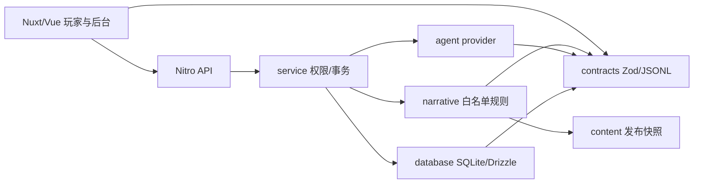

# 实施基线与范围

执行模式 implement-mvp。目标仓库 guoweiyi/CareerScape，工作副本 E:/dc/CareerScape。首包是栖木工作室的原创合成职业演示《上线前的最后一小时》，QA新人面对预约小程序发布前的重复提交问题。三位同事林澄（QA）、周砚（开发）、许知（产品）都有职责边界。

假设：没有生产域名、外部邮箱或模型密钥。登录采用用户名/密码与一次性恢复码，真实provider需服务端配置后启用；默认mock明确标注。没有行业审核者，domainReviewStatus保持pending，以原创合成demo门禁发布。音乐延期，完整静音可玩。生产首选单写Node+持久卷SQLite/WAL，远程libSQL列为迁移方案，未部署。

P0以真实端到端链路为准，不以目录/示例数量为完成证据。P1/P2在roadmap维护，不创建空菜单。UI消息单一源为服务端确认数据，Pinia仅视图/偏好/待确认动作；原生fetch NDJSON独立于AI SDK UI流。对白纯文本，不加载富文本链。SSR仅公开目录，私密路由不缓存。头像/立绘/背景必须是工具实际生成文件，缺少时记录blocked。

浏览器不导入DB和provider。内部packages采用可独立测试的源码边界，不为一次应用分发建立多个包构建器。
