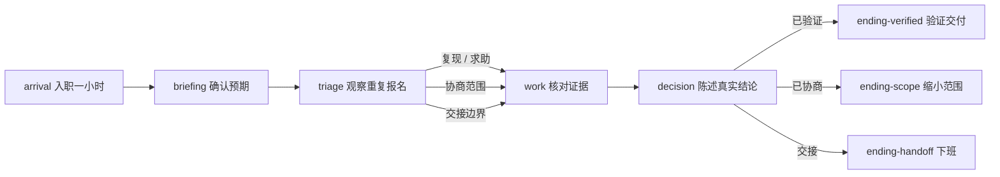
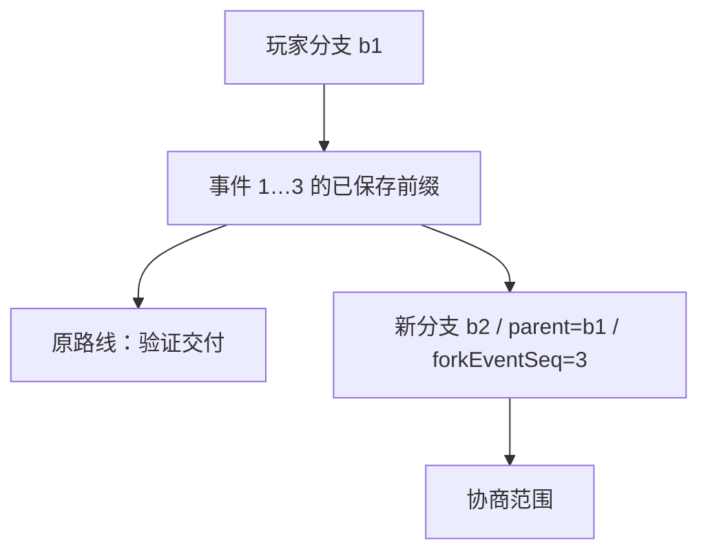

# 叙事运行时、分支与 JSONL 契约

领域纯函数位于 `packages/narrative/engine.ts`，契约位于 `packages/contracts/`。首版作者图无环；同一作者节点可以有多个前驱，而玩家分支仍然是有唯一父分支的树。流式帧是传输，事件日志是已提交事实，两者的序号用途不同。

标准路线访问 6 个节点；作者库存共 8 个节点。求助、职责切换是节点内受限动作，不添加作者图循环。任何非终点都可以 `leave` 到交接结局，不要求完成整条路线。没有分数、人格或职业适配判断。全局 `switch_role` 显示产品原先独有的范围材料，但不改变 NPC 所知；再次调用回到测试职责。

作者图合流不合并玩家记忆。访问实例、分支、事件序号与节点 ID 分别由服务端记录。回放取真实事件文本，不重新调用模型。人物 `knowledge` 和描述性 `relations` 是虚构局内参数，不能当作对学生的心理标签。

## 白名单条件与效果

条件仅支持 `flag / time_before / task_is / knows`；效果仅支持 `set_flag / advance_time / set_task / reveal / relation / resolve`。标记键固定为 8 个首包定义字段；不支持任意路径写入、SQL、脚本或网络请求。Zod 使用严格对象拒绝额外字段。`applyChoice` 返回新状态，不改变原包与旧状态；只有规则筛出的当前选项或明确支持的全局动作可以执行。

自由输入由在线服务解释和回复，低置信意图不会自行产生世界效果。用户说“已经好了”不等于真实完成记录。求助、解释或内容缺口可以保持当前节点并返回可执行选项。

## 帧与提交

传输为 `fetch` + `ReadableStream` + 自定义 `JsonlParser`，Content-Type 为 `application/x-ndjson`。它与 AI SDK 的 UI Message Stream 不是同一个协议。P0 先完整缓冲和检查 NPC 话轮，事务保存后才分段发送已保存文本；这不是未缓冲的模型 token 直出。

共同字段为 `protocolVersion:1, type, frameId, streamId, streamSeq, turnId, sessionId, branchId, at, payload`。`frameFactory(context)` 自动分配一个流内的连续序号。持久 `revision/eventSeq` 由业务事务提供，心跳不能推进存档版本。

| type | payload 核心字段 | 客户端含义 |
|---|---|---|
| turn_started | expectedRevision | 开始等待 |
| heartbeat | 空对象 | 活跃连接，不是存档 |
| tool_status | 白名单 status + label | 无敏感内容的阶段提示 |
| message_start | messageId, speakerId, provisional:false, committedRevision | 开始显示已保存消息 |
| message_delta | messageId, text, provisional:false, committedRevision | 仅显示文字，不修改世界状态 |
| turn_committed | revision, eventSeq, messageIds, session | 使用完整会话快照对齐 |
| turn_failed | code, message, retryable, revision | 保留输入并恢复提交点 |
| turn_cancelled | revision | 提交前取消 |
| stream_end | status | 与前面业务结果一致，不单独证明提交 |

完整可执行帧示例在 `tests/protocol.test.ts` 的 `conversation()`，覆盖开始、心跳、消息起始、中文/emoji delta、全量提交通知及结束。解析器有意不把任意 `session` 对象理解为已授权状态；当前页面在提交与结束帧通过校验后，以有归属检查的 GET 会话接口对齐权威状态。

解析器使用 fatal UTF-8 `TextDecoder` 跨块处理，支持半行、CRLF、多行和最后一帧无换行。默认单行 256,000 字节、整流 2,000,000 字节、最多 4096 帧；记录已见帧，完全一致的重传幂等，同序号不同内容、帧 ID 复用、归属变化、缺号、未知版本和非法 schema 立即失败。只允许一次开始与业务结果；每个 delta 必须对应同修订消息起始，提交消息集合必须与流中的消息一致，业务结果后不能再追加文字。有限上限同时约束去重内存。未知版本提示刷新升级。

会话快照另设完整消息窗口 100,000 字节 / 最多 60 条与快照整体 220,000 字节上限，避免长期聊天突破单帧限制。历史从专用接口分页获取；窗口以外的消息仍保存在事件日志中。传输限制与长中文测试见[API契约](api.md)和[验收记录](verification.md)。

缺少 `stream_end`、只有结束帧没有业务结果、结束状态与结果不一致均不能宣布同步成功。收到提交后才断线，业务可能成功；客户端查询回合状态/完整会话，按原 `clientActionId` 重试，不重新推断状态。取消网络读取不能撤销已提交动作；改变选择需要新动作或分支。

## 已运行的领域验证

具体运行结果在交付记录中更新，测试文件为 `tests/domain.test.ts`、`tests/domain-pipeline.test.ts`、`tests/protocol.test.ts`。覆盖三条完整路线、求助和退出、职责信息差、非法 DSL、图循环/引用、同 seed、前提和缺席过滤、互斥/冷却、不可变旧包、预算暂停/失败续跑/审核保护，以及字节级 UTF-8、重复与冲突、缺号、心跳、坏 JSON、大小上限、缺 end。数据库幂等、权限和 UI 恢复由服务层和端到端测试另外验证，领域测试不冒称覆盖真实 AI 质量。
