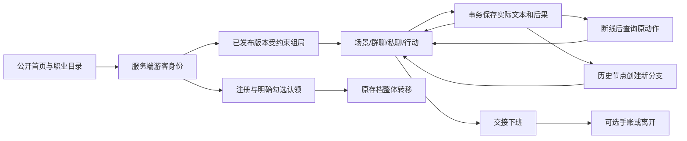
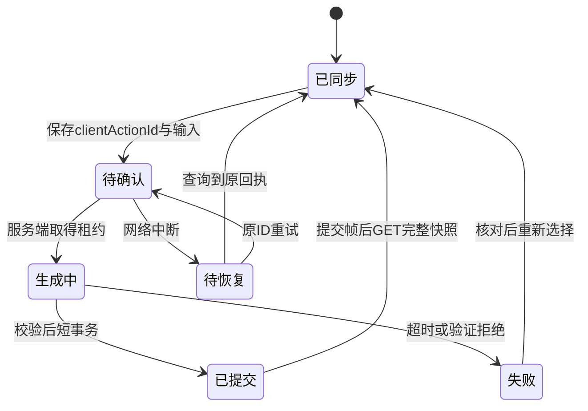

# 产品、交互与工程决策

## 首版要解决的问题

学生常能说出岗位名，却缺少对具体工作、协作对象与职责边界的体验。本产品让学生进入一段可退出的虚构工作日，试着提问、处理材料、作出选择；不宣称测出适配度、改善就业率或提供企业实时内部体验。

首包以重复报名问题为中心：观察预期与实际、交换复现材料、确认验证范围、产品协商、交接下班。林澄负责质量复核，周砚负责开发候选，许知负责范围与发布决策。玩家不能越权批准发布。角色卡、完整台词和事实唯一权威是 `packages/content/seed.ts` 的冻结内容包，避免文档与剧本各写一份互相漂移。

体验从首页选择岗位进入。剧情界面上方是场景与当前说话人，下方是对白、行动和自由输入。群聊与私聊共用已保存消息源；材料卡和职责切换为仅本人可见解释。下班后不强制报告，可写手账、返回历史或直接离开。

## 架构决策

| ADR | 决定 | 原因/限制 |
|---|---|---|
| 001 | 单Nuxt应用承载玩家端和后台 | 后端角色授权隔离；首版不复制两套应用 |
| 002 | Node单写服务+SQLite WAL | 短事务、唯一性、可恢复；不是多实例共享盘扩容 |
| 003 | 原生fetch NDJSON+只读分段显示 | 与AI SDK UI流明确分开；服务端先校验并提交整回合 |
| 004 | 不可变作者图+玩家分支+追加事件 | 作者合流与玩家存档合并不是一回事 |
| 005 | 合成内容离线生产/审核，线上只表达 | 模型不能创建公共节点、改权限或直接写世界状态 |
| 006 | 用户名密码+恢复码+Session Cookie | 不依赖尚未配置的邮件/短信资质；恢复码丢失不绕过验证 |
| 007 | 对白纯文本 | Vue文本插值，不解析用户HTML、组件或任意链接 |
| 008 | 图片离线生成、内容哈希与版本清单 | 旧局引用旧manifest；运行时不现场生图 |
| 009 | Pinia只存UI偏好 | 认证和权威存档在服务端；IndexedDB仅限过期草稿/待确认动作 |

模块依赖图见 `implementation-scope.md`，数据库ER见 `backend-operations.md`，作者图/玩家树/流协议见 `narrative-protocol.md`。这些是独立对象，不用一张“多叉树”图代替全部结构。

公开首页SSR；游戏、账号、存档与管理路由CSR并发送private/no-store，所有API也禁止共享缓存。SSR不读浏览器存储。IndexedDB按用户+会话隔离，最多20条、单条15KB、7日过期，登出或身份切换清理；只有无敏感信息的偏好进入localStorage。

## 回合状态

取消网络等待不撤销已提交行动；更改选择须新动作或分支。UI不会用 `message_delta` 修改世界状态，也不会用旧回执覆盖较新存档。相同动作ID不同正文拒绝，生成发生在事务外，提交前重查租约/修订/身份。

## 评价与研究边界

拟验证的问题：体验后能否更具体描述一个任务；能否形成有根据的新问题；是否愿意继续探索。研究需独立自愿同意与退出，不以时长、成就数、自评分替代教育成效。当前未开展用户研究、未采集真实学生反馈，不能报告教育效果。

## 可访问性与性能预算

目标为390×844普通手机视口及1440×900桌面，补360窄屏与200%字号检查。优先中文系统字体，核心对白16px以上；键盘焦点可见、控件以44px为目标、完整句子播报、弹层焦点约束。默认静音、减少动态和纯文字模式保留核心行动。

预算（目标而非实测）：必要首场景视觉≤2.5MB，全包视觉≤12MB；客户端初始压缩JS≤250KB，场景切换已有资源时≤300ms，真实AI整回合25秒超时。资源实际大小见美术报告，浏览器结果见verification。尚未测真实弱网解码、低端机长任务/内存、微信WebView和真实AI首字/总延迟，不能把桌面浏览器模拟当真机。
